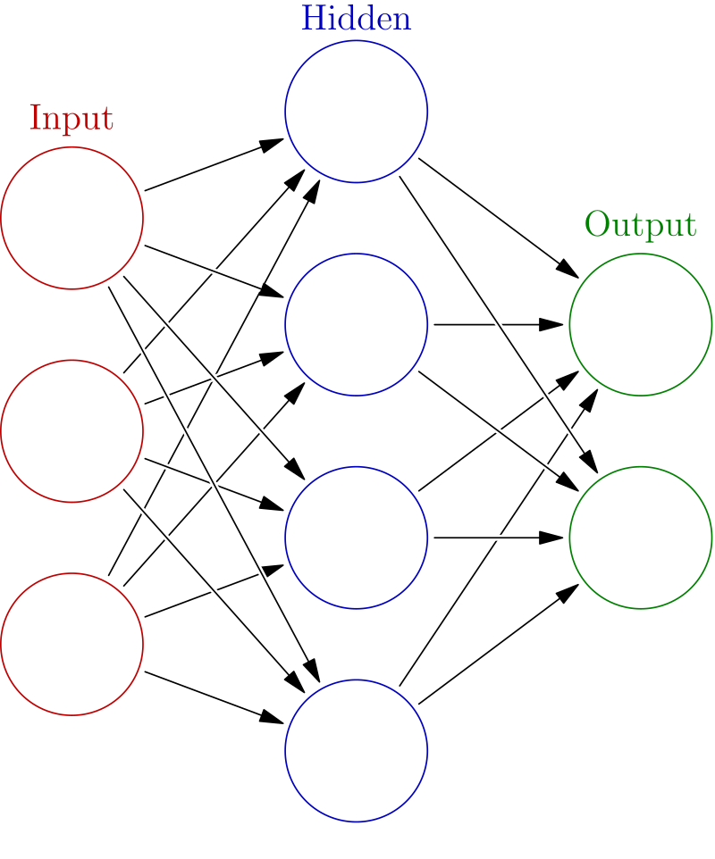

# Machine learning

Machine learning is a part of computer science dedicated to creating and understanding structures and algorithms that can improve themselves - in a process similar to humans learining things as they grow. This field of study is closely related to statistics, and finds applications in many not computers-related fields such as medicine, astronomy or agriculture.

There are 3 main approaches to machine learning:

- Supervised learning
- Unsupervised learning
- Reinforcement learning

## Supervised learning

In this approach the model is built upon dataset that contains inputs and desired outputs. The model is supposed to discover rules that connect inputs and outputs. This requirement renders a huge drawback - training data has to be labeled by humans.

This is the approach that will be used in this program. More specifically the model will be able to learn using datasets that contain numerical-only inputs and one output - record's class. Example of such dataset is the iris dataset.

# Neural networks

One type of models used in ML are **neural networks**. They are structrures loosely based on animal brains. Single neural network consists of many even smaller structures called neurons. They are based on biological brains' **neurons**. Neurons in network are connected together and they transmit signals between each other.

In their simplest form neurons form themselves in **layers**, such that neurons in single layer can tereat only neurons in previous layer as their inputs. If the connections between neurons don't form a cycle the network is called **feedforward network**.

## Feedforward networks

Below you can see a image of simple feedforward network:

As you can see, there are 3 types of layers in a feedforward neural network:

### Input layer

The first layer, colored red on the image above, is the input layer. There is always one input leayer in network, and dataset input serve as its inputs.

### Hidden layer

Network may contain zero or more hidden layers. Values of neurons in previous layer serve as inputs for hidden layer, and its outputs are connected to next layer in network as well.

### Output layer

The last layer in network is called output layer. Just like hidden layer, outputs of previous layer are connected as inputs to output layer, but values of neurons in output layer are not used in the network. Instead based on the neuron values user determines the output of whole network. In this program each neuron in output layer corresponds to one class from the dataset.

## How do neurons work

As mentioned earlier, each neuron has a set of connections and its value.

But how does each neuron figure its value? It's using a preety simple formulas:

$$ a = b + \sum_{i=1}^{n} w_{i}z_{i} $$
$$ z = f(a) $$

Breaking it into parts - $ a $ stands for neuron value before activation. $ b $ is the neuron bias - its property. The bias is added to te sum of products of previous layer's neuron values ($ z_{i} $) and their associated weights ($ w_{i} $). In the input layer instead of neuron values, $ z_{i} $ stands for input value taken from dataset. $ n $ is the number of neurons in previous layer (or number of inputs for current neuron).

Final value of neuron $ z $ is the value of neuron's activation function $ f $ at $ a $. Activation functions are usually nonlinear, like sigmoid functions or ReLU function.

### Vector approach

You might be familiar with the sum in first equation - it's preety similar to definition of dot product. - In fact, we can store layer's input and biases as vectors, and weights as matrix (in which each column represents weights for single neuron in layer). It allows us to calculate values for all neurons in layer using equations taht correspond to those above:

$$ A = Z_{i-1}W + B $$
$$ Z_{i} = f(A) $$

Where $ i $ stands for layer number, $ A $ is vector of neurons' values before activation, $ Z_{i-1} $ is vector outputs of previous layer (or dataset inputs), $ W $ is matrix of weights (as described above), $ B $ is vector of biases, and $ Z_{i} $ is vector of current layer neuron values.
$ f(A) $ is element-wise aplication of $ f $ for matrix $ A $

# Backpropagation

Great! Now we know how do neural network process data. But even more important is how they **learn** to correctly classify entries in datasets. One of the most basic algorithms used for neural network lerning is the **backpropagation** algorithm.

## Error function

First task is to evaluate the network on how well it does its job. In order to do so we pass network outputs and correct outputs of train dataset to **error function**. The higher the value of that error function the worse the network performed. One of the most commonly used error functions is the mean squared error function: $$ E_{n} = \frac{(z_{n} - r_{n})^{2}}{2} $$ $ E_{n} $ is error of given neuron in output layer, $ z_{n} $ is that neuron value and $ r_{n} $ is the expected value of that neuron. Error of the network $ E $ is sum of all errors of neurons in output layer.

## Gradient descent

In order to improve performance ot the network we want its error function to be as low as possible. We can do it by finding minimum of error function using for example method known as gradient descent.

Since value of error function depends on all parameters (biases and weights) in network, we have to calculate error function derivatives for all of them.

### Output layer

Let's start by explaining how it works for neurons in output layer, since we've already calculated their errors.

In order to calculate $ \frac{dE}{dw_{i}} $ (derivative of error function with respect to any input weight) of we will apply the chain rule.